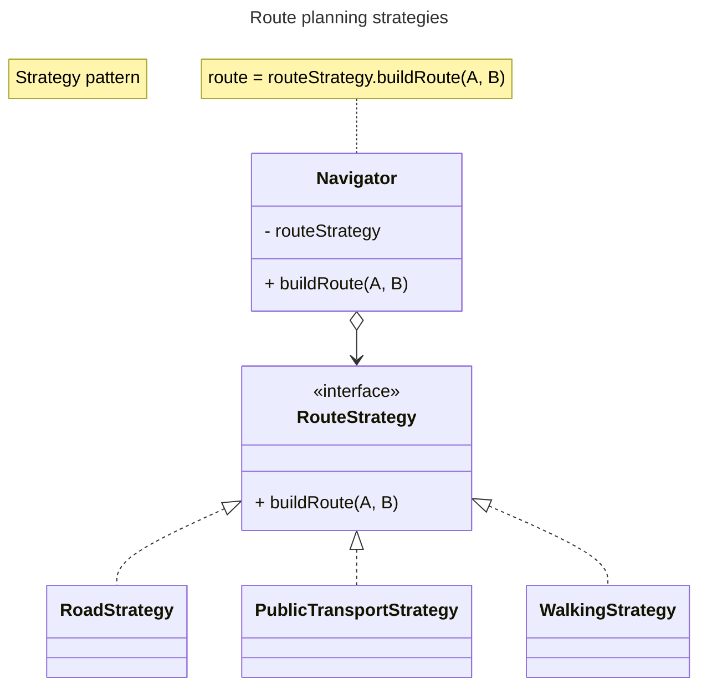

# Strategy

Is a behavioral design pattern that lest you define a family of algorithms, put them into a separate class, and make
their objects interchangeable.

Strategy pattern suggests that you take a class that does something specific in a lot of different ways and extract
all of these algorithms into separated classes called **strategies**.

